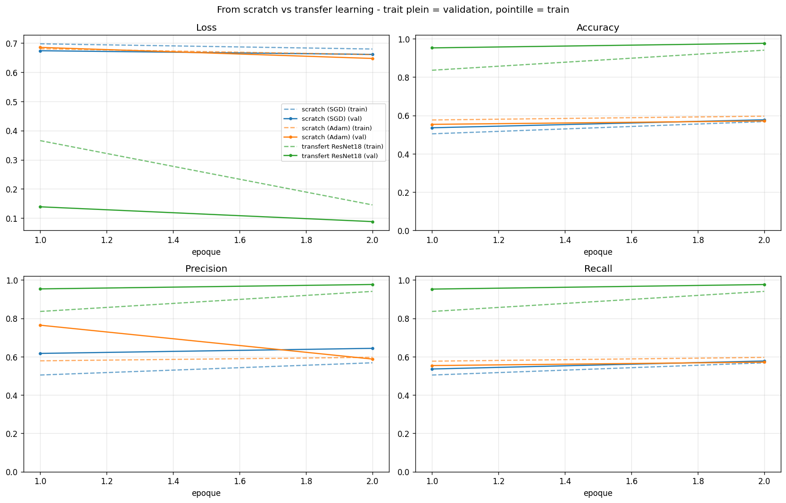

# CNN from scratch vs Transfer Learning — Cats vs Dogs

Classification binaire chat / chien sur le jeu de données [Dogs vs Cats](https://www.kaggle.com/c/dogs-vs-cats).
L'objectif est de **comparer deux approches entraînées sur les mêmes données** :

- **Expérience A** — un CNN entraîné *from scratch* (4 blocs convolutifs, BatchNorm + Dropout) ;
- **Expérience B** — du *transfer learning* à partir d'un ResNet18 pré-entraîné sur ImageNet
  (extraction de features puis fine-tuning du dernier bloc).

Tout le travail tient dans le notebook **`Part 7 - Loading Image Data (exo)_v2.ipynb`** :
la partie 1 reprend le TP de chargement d'images, la partie 2 contient le devoir.

---

## 1. Environnement

```bash
python -m venv .venv
# Windows
.venv\Scripts\activate
# Linux / macOS
source .venv/bin/activate

# GPU (CUDA 12.1) — recommandé
pip install torch torchvision --index-url https://download.pytorch.org/whl/cu121
pip install -r requirements.txt
```

Sur CPU, `pip install -r requirements.txt` suffit : le notebook détecte l'absence de GPU
et bascule automatiquement en mode réduit (`FAST_DEV = True` : sous-échantillon de 5 % des
données et 2 époques), afin de rester exécutable de bout en bout. **Les résultats publiés
ci-dessous doivent être produits sur GPU**, avec `FAST_DEV = False`.

**Sans GPU local : Google Colab.** Déposer le dossier du projet (avec `Cat_Dog_data/`) dans
`MyDrive/Deep_learning/cnn_cat_dog_image_classification`, ouvrir le notebook dans Colab,
choisir *Exécution > Modifier le type d'exécution > GPU (T4)*, puis *Tout exécuter*. La
cellule de configuration détecte Colab et monte le Drive automatiquement.

Vérification du GPU (affichée par la première cellule de la partie 2) :

```python
torch.cuda.is_available()          # True attendu
torch.cuda.get_device_name(0)
```

## 2. Organisation des données

Les données ne sont **pas versionnées** (voir `.gitignore`). À télécharger et décompresser
à la racine du projet :

```bash
wget https://s3.amazonaws.com/content.udacity-data.com/nd089/Cat_Dog_data.zip
unzip Cat_Dog_data.zip
```

Arborescence attendue :

```
Cat_Dog_data/
├─ train/
│  ├─ cat/   (11 250 images)
│  └─ dog/   (11 250 images)
└─ test/
   ├─ cat/   (1 250 images)
   └─ dog/   (1 250 images)
```

Le jeu de **validation** (15 %) est découpé dans `train/` par le notebook, de façon
stratifiée et reproductible. Le dossier `test/` sert **uniquement** au test final.

## 3. Entraînement

Ouvrir le notebook et exécuter les cellules dans l'ordre (`Run All`). Les hyperparamètres
sont regroupés dans la première cellule de la partie 2 :

| Paramètre | Valeur | Remarque |
|---|---|---|
| `SEED` | 42 | fixé pour `random`, `numpy`, `torch`, CUDA |
| `IMG_SIZE` | 224 | identique pour les deux expériences |
| `BATCH_SIZE` | 64 (GPU) / 32 (CPU) | |
| `VAL_RATIO` | 0.15 | split stratifié |
| `EPOCHS_SCRATCH` | 12 | expérience A |
| `EPOCHS_TRANSFER` | 5 (+ 3 de fine-tuning) | expérience B |

**Expérience A — from scratch.** 4 blocs `Conv-BN-ReLU ×2 → MaxPool → Dropout2d`, tête
`AdaptiveAvgPool → Dropout(0.5) → Linear`. Une recherche de learning rate est d'abord menée
sur un sous-échantillon pour **SGD** (momentum 0.9, nesterov, weight decay 5e-4) et **Adam**
(weight decay 1e-4) ; les deux optimiseurs sont ensuite entraînés entièrement avec leur
meilleur learning rate, sous `CosineAnnealingLR`.

**Expérience B — transfer learning.** ResNet18 `IMAGENET1K_V1`, `fc` remplacée par
`Dropout(0.3) + Linear(512, 2)`.
Phase 1 : backbone gelé (BatchNorm forcée en `eval`), Adam lr 1e-3.
Phase 2 : `layer4` dégelée, Adam lr 1e-4.

## 4. Évaluation et rechargement du modèle

Le meilleur checkpoint de chaque expérience (critère : accuracy de validation) est écrit dans
`checkpoints/<nom_du_run>_best.pt`, avec les poids, l'époque, les classes, la taille d'image
et les paramètres de normalisation. La partie 8 du notebook **reconstruit les modèles vides et
recharge ces fichiers depuis le disque** avant de calculer les métriques de test — ce n'est
donc pas le modèle resté en mémoire qui est évalué.

```python
model, ckpt = load_checkpoint("checkpoints/transfer_resnet18_finetuned_best.pt",
                              lambda: TransferModel(freeze=False))
stats = evaluate(model, test_loader)
```

Journaux d'entraînement :

```bash
tensorboard --logdir runs
```

## 5. Résultats

> **État actuel.** La machine de développement n'a pas de GPU : l'exécution de bout en bout a
> été faite sur CPU en mode réduit (`FAST_DEV`, 5 % des données, 1 à 2 époques). Elle valide
> que la chaîne complète fonctionne (entraînement, checkpoints, rechargement, test), mais ses
> chiffres ne sont **pas représentatifs** : la recherche de learning rate
> (`results/lr_search.json`) donne 0.47 de val accuracy pour toutes les configurations, le
> modèle n'ayant pas eu le temps de sortir de la prédiction d'une classe unique.
> Les valeurs définitives s'obtiennent en relançant le notebook sur GPU (voir section 1).

Le notebook génère automatiquement :

| Fichier | Contenu |
|---|---|
| `results/summary.md` | tableau des métriques de test (loss, accuracy, précision, recall, F1) |
| `results/lr_search.json` | grille SGD / Adam × learning rates |
| `results/curves_comparison.png` | courbes loss / accuracy / précision / recall, train et val |
| `results/confusion_matrices.png` | matrices de confusion des deux modèles |

| Modèle | Paramètres | Test loss | Accuracy | Precision | Recall | F1 |
|---|---:|---:|---:|---:|---:|---:|
| CNN from scratch | ~1,2 M | — | — | — | — | — |
| Transfer learning (ResNet18) | ~11,2 M (1 026 entraînés en phase 1) | — | — | — | — | — |




**Analyse.** La partie 10 du notebook développe la comparaison (convergence, performance,
effet des deux optimiseurs, effet de la régularisation, erreurs typiques). En résumé : le
transfer learning converge dès la première époque parce qu'il réutilise des features apprises
sur ImageNet — corpus qui contient justement de nombreuses races de chats et de chiens — là où
le CNN from scratch doit apprendre ses filtres de bas niveau à partir des seules ~19 000 images
d'entraînement. Le gain n'est pas un gain de capacité : en phase 1, le transfert n'entraîne
qu'un millier de paramètres contre ~1,2 million pour le modèle from scratch.

## 6. Limites et pistes d'amélioration

- Un seul seed : les écarts inférieurs à un point ne sont pas nécessairement significatifs.
- Le fine-tuning ne dégèle que `layer4` ; des learning rates différenciés par bloc feraient
  probablement mieux.
- Pistes : EfficientNet / ConvNeXt, MixUp ou CutMix, early stopping, test-time augmentation,
  calibration des probabilités.

## 7. Structure du dépôt

```
.
├─ Part 7 - Loading Image Data (exo)_v2.ipynb   # TP + devoir
├─ my_helper.py                                 # fonctions d'affichage du TP (importé partie 1)
├─ requirements.txt
├─ .gitignore
├─ README.md
├─ Cat_Dog_data/    (non versionné)
├─ checkpoints/     (non versionné)
├─ runs/            (non versionné)
└─ results/         # tableaux et figures générés
```
